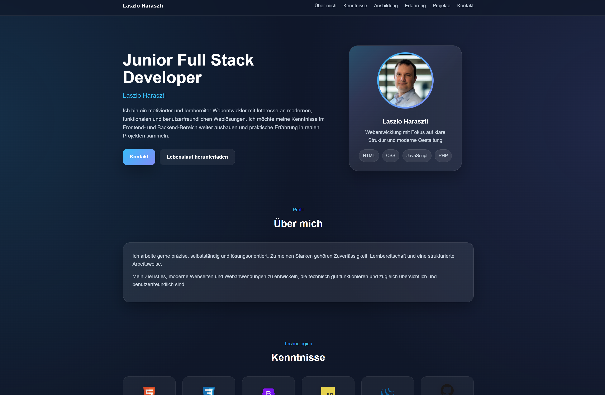

# Laszlo Haraszti – Portfolio Website

## English

This is a personal portfolio website created to present Laszlo Haraszti’s profile, technical skills, education, work experience, and projects.

### Features

* modern and clean design
* fully responsive layout
* animated elements and interactive cards
* dedicated sections for profile, skills, education, experience, projects, and contact
* downloadable CV and certificates

### Technologies Used

* HTML5
* CSS3
* JavaScript
* Responsive Web Design
* CDN-based developer icons

### Sections

* **Hero** – short introduction and profile image
* **About** – personal profile and strengths
* **Skills** – technologies and development knowledge
* **Education** – completed training and certificates
* **Experience** – previous work experience
* **Projects** – selected works and applications
* **Contact** – email, phone, GitHub, and LinkedIn

### Purpose

The purpose of this project is to provide a clear and professional online portfolio that can be used for self-presentation and job applications.

## Live Demo

The portfolio website can be viewed here:

[Open Live Demo](https://laci528-creator.github.io/meine_lebenslauf/)

## What I Learned

During this project I practiced:

* building a responsive single-page portfolio website
* structuring content into clear sections
* using semantic HTML elements
* styling layouts with CSS
* adding simple JavaScript interactions
* presenting projects and certificates in a professional way
* preparing a website for job applications

## Screenshot

---

## Deutsch

Dies ist eine persönliche Portfolio-Webseite, die erstellt wurde, um das Profil, die technischen Kenntnisse, die Ausbildung, die Berufserfahrung und die Projekte von Laszlo Haraszti zu präsentieren.

### Funktionen

* modernes und klares Design
* vollständig responsives Layout
* animierte Elemente und interaktive Karten
* eigene Bereiche für Profil, Kenntnisse, Ausbildung, Erfahrung, Projekte und Kontakt
* Lebenslauf und Zertifikate zum Download

### Verwendete Technologien

* HTML5
* CSS3
* JavaScript
* Responsive Webdesign
* Entwickler-Icons über CDN

### Bereiche

* **Hero** – kurze Vorstellung und Profilbild
* **Über mich** – persönliches Profil und Stärken
* **Kenntnisse** – Technologien und Entwicklerkenntnisse
* **Ausbildung** – abgeschlossene Kurse und Zertifikate
* **Berufserfahrung** – bisherige Arbeitserfahrung
* **Projekte** – ausgewählte Arbeiten und Anwendungen
* **Kontakt** – E-Mail, Telefon, GitHub und LinkedIn

### Ziel

Ziel dieses Projekts ist es, ein übersichtliches und professionelles Online-Portfolio bereitzustellen, das für die persönliche Präsentation und für Bewerbungen genutzt werden kann.

## Was ich gelernt habe

Während dieses Projekts habe ich Folgendes geübt:

* Aufbau einer responsiven One-Page-Portfolio-Webseite
* Strukturierung von Inhalten in übersichtliche Bereiche
* Verwendung semantischer HTML-Elemente
* Gestaltung von Layouts mit CSS
* Hinzufügen einfacher JavaScript-Interaktionen
* professionelle Präsentation von Projekten und Zertifikaten
* Vorbereitung einer Webseite für Bewerbungen

## Screenshot

